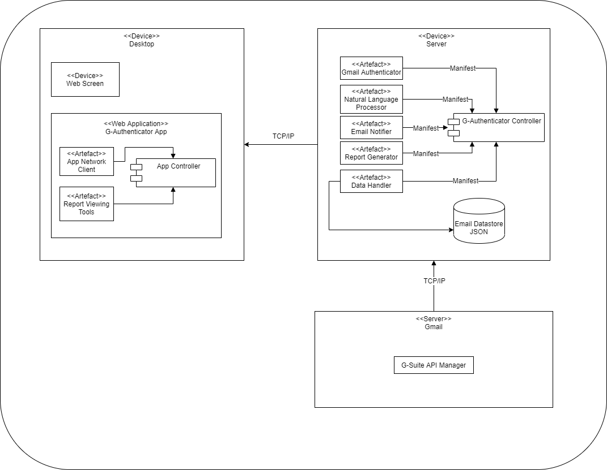

# COS730_G-Authenticator Soultion
This is the workspace for Stylometrics Framework Repository

Name: Neo Thokoa
Student number: u14163285

Project management board: https://github.com/Neo-Thokoa/COS720_G-Authenticator#workspaces/cos730-assignment3-5ec424d4d77337c6ec7b681d/board?repos=263448996

Techmical Skills:
Web Development - AngularJS, NodeJS, Mongo, Express, LAMP Stack
Software Development - Java, C++, C#
Mobile Develoment (Android Java)
Database - Postgresql, MySql, MongoDb

Web appliaction URL: https://johnojo.github.io/COS730-Assignment/

Interests: Technology, Sporting Fanatic, Entertainment, Data Science
 
User Manual: https://github.com/JohnOjo/COS730-Assignment/blob/master/Documents/Patientbase%20User%20Manual.pdf

## The G-Authenticator

*The G-Authenticator System* is a system that authenticates emails and warns users if a mismatched email has been detected. The system is developed to integrate with Gmail as it is the most used email service in the world

### Deployment Model

Format: 

* This system uses AngularJS 1.7 for its client side front-end
* The Backend runs with Node
* The interaction between the system and Gmail is through Python

